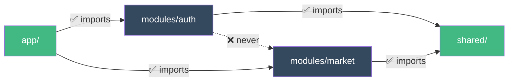
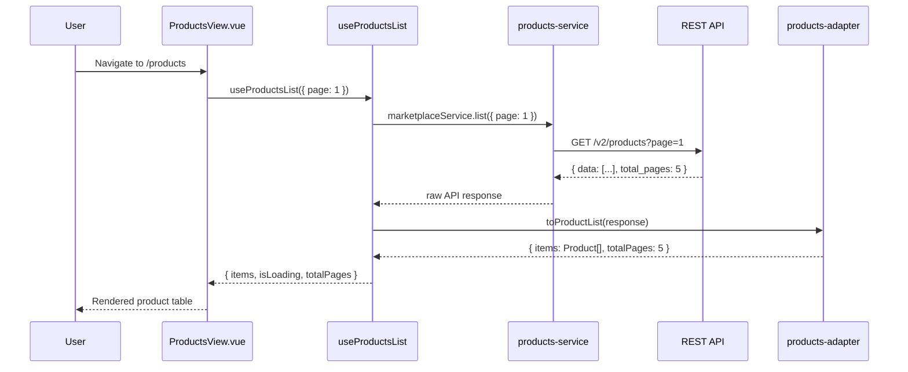

# Architecture Overview

The `docs/ARCHITECTURE.md` in your project is the **source of truth** that all agents follow. This page summarizes the key patterns.

## Modular Structure

Every feature is a self-contained module:

```text
src/modules/[feature]/
├── components/     ← UI
├── composables/    ← Logic (service → adapter → query)
├── services/       ← Pure HTTP (no try/catch)
├── adapters/       ← Parsers (API ↔ App)
├── stores/         ← Client state only (Pinia)
├── types/          ← .types.ts (API) + .contracts.ts (App)
├── views/          ← Pages
├── __tests__/      ← Tests
└── index.ts        ← Barrel export (public API)
```

## Import Rules



- **Modules → Shared**: ✅ Allowed
- **Modules → Modules**: ❌ Never (move shared code to `shared/`)
- **App → Modules**: ✅ Router and registration only

## Four-Layer Architecture


| Layer | Does | Does NOT |
|-------|------|----------|
| **Service** | HTTP calls | try/catch, transformation, logic |
| **Adapter** | Parse API ↔ App (snake_case → camelCase) | HTTP, side effects |
| **Composable** | Orchestrate service + adapter + Vue Query | Render UI |
| **Pinia Store** | Client state (UI, filters, preferences) | Server state, HTTP |
| **Component** | UI + composition | Heavy business logic |

## Data Flow Example

Here's what happens when a user visits the Products page:



::: tip State Management Split
**Pinia** = Client state (UI, filters, preferences)
**Vue Query** = Server state (API data, caching, background refresh)
:::

## Naming Conventions

### Files

| Type | Pattern | Example |
|------|---------|---------|
| Directories | `kebab-case` | `user-settings/` |
| Components | `PascalCase.vue` | `UserSettingsForm.vue` |
| Views | `PascalCase + View.vue` | `MarketplaceView.vue` |
| Composables | `use + PascalCase.ts` | `useMarketplaceList.ts` |
| Services | `kebab-case-service.ts` | `marketplace-service.ts` |
| Adapters | `kebab-case-adapter.ts` | `marketplace-adapter.ts` |
| Stores | `kebab-case-store.ts` | `marketplace-store.ts` |
| Types | `kebab-case.types.ts` | `marketplace.types.ts` |
| Contracts | `kebab-case.contracts.ts` | `marketplace.contracts.ts` |

### Code

| Type | Pattern | Example |
|------|---------|---------|
| Variables / functions | `camelCase` | `getUserById`, `isLoading` |
| Types / Interfaces | `PascalCase` | `UserProfile`, `MarketplaceItem` |
| Constants | `UPPER_SNAKE_CASE` | `API_BASE_URL`, `MAX_RETRIES` |
| Composables | `use` + `PascalCase` | `useAuth`, `useMarketplaceList` |
| Booleans | `is`/`has`/`can`/`should` | `isLoading`, `hasPermission` |
| Event handlers | `handle` + action | `handleSubmit`, `handleDelete` |

## Key Patterns

- **Stop Prop Drilling**: Use slots + provide/inject + direct composables
- **Utils vs Helpers**: Utils = pure functions, Helpers = functions with side effects
- **Error Handling**: Centralized in composables (Vue Query `onError`)
- **SOLID in Vue**: Each file = 1 responsibility

## Deep Dive

- [Layers](/guide/layers) — Detailed examples of each layer
- [Components](/guide/components) — Component patterns and composition
- Full reference: `docs/ARCHITECTURE.md` in your project
