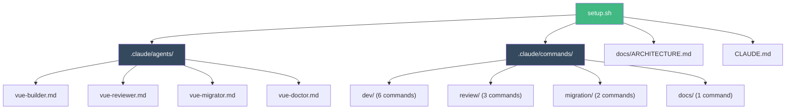

# Installation

## Prerequisites

- A Vue 3 project with `package.json`
- [Claude Code](https://docs.anthropic.com/en/docs/claude-code) installed

## Quick Install

### macOS / Linux

```bash
# 1. Clone the kit
git clone https://github.com/HerbertJulio/vue-dev-kit.git

# 2. Go to your Vue project
cd /path/to/your-vue-project

# 3. Run the installer
bash /path/to/vue-dev-kit/setup.sh
```

### Windows (Git Bash or WSL)

```bash
# 1. Clone the kit
git clone https://github.com/HerbertJulio/vue-dev-kit.git

# 2. Go to your Vue project
cd C:/path/to/your-vue-project

# 3. Run the installer
bash C:/path/to/vue-dev-kit/setup.sh
```

::: tip Windows users
You need **Git Bash** (comes with Git for Windows) or **WSL** to run the setup script. PowerShell alone won't work with bash scripts.
:::

## What Gets Installed



The installer copies these files into your project:

```text
your-vue-project/
├── .claude/
│   ├── agents/              ← 4 AI subagents
│   │   ├── vue-builder.md
│   │   ├── vue-reviewer.md
│   │   ├── vue-migrator.md
│   │   └── vue-doctor.md
│   └── commands/            ← 12 slash commands
│       ├── dev/
│       ├── review/
│       ├── migration/
│       └── docs/
├── docs/
│   └── ARCHITECTURE.md      ← Source of truth for patterns
└── CLAUDE.md                 ← Project config for Claude
```

::: warning Non-destructive
The installer **never overwrites** existing `ARCHITECTURE.md` or `CLAUDE.md` files. If they already exist, they are skipped.
:::

## Lite Mode (Lower Cost)

For budget-conscious usage, install Lite agents that run on the **Haiku model**:

```bash
bash /path/to/vue-dev-kit/setup.sh --lite
```

| Aspect | Full | Lite |
|--------|------|------|
| **Model** | Sonnet/Opus | Haiku |
| **Cost** | ~5-25k tokens | ~2-10k tokens |
| **Validation** | tsc + build + vitest | Skipped |
| **First action** | Reads ARCHITECTURE.md | Rules inline |

Same agent names, same capabilities — just cheaper per invocation.

## Verify Installation

```bash
# Open Claude Code
claude

# Check agents are loaded
/agents

# Try a quick command
/review-check-architecture
```

You should see 4 agents listed: `@vue-builder`, `@vue-reviewer`, `@vue-migrator`, `@vue-doctor`.

## Recommended: Context7 MCP

For even better results, add the [Context7 MCP server](https://github.com/upstash/context7) to give Claude real-time access to Vue 3, Pinia, and TanStack Query docs:

```json
// ~/.claude/mcp.json
{
  "mcpServers": {
    "context7": {
      "command": "npx",
      "args": ["-y", "@upstash/context7-mcp@latest"]
    }
  }
}
```

## Next Steps

- [Quick Start](/guide/quick-start) — Build something with the agents
- [Architecture Overview](/guide/architecture) — Understand the patterns
- [Customization](/customization/creating-agents) — Adapt the kit to your project
