# Introduction

## What is Vue Dev Kit?

Vue Dev Kit is an open-source collection of **agents**, **slash commands**, and **architectural conventions** designed for [Claude Code](https://docs.anthropic.com/en/docs/claude-code).

Once installed in your Vue project, Claude automatically follows your architecture rules, generates consistent code, reviews PRs, migrates legacy code, and more.

**It's not a library or framework** — it's a set of markdown instructions that make Claude Code work like a senior Vue developer who knows your codebase conventions.

## What You Get

| Feature | Count | Description |
|---------|-------|-------------|
| AI Agents | 4 | Consolidated specialists: builder, reviewer, migrator, doctor |
| Lite Agents | 4 | Same agents running on Haiku model (lower cost) |
| Slash Commands | 12 | Shortcuts to scaffold and validate code |
| Architecture Guide | 1 | Comprehensive source of truth for all patterns |

## Your AI Team

Vue Dev Kit has **4 agents** organized by two scenarios:

```mermaid
graph TB
    subgraph daily["🏗️ Day-to-Day Development"]
        Builder["@vue-builder<br/><i>Create modules, components,<br/>services, composables, tests</i>"]
        Reviewer["@vue-reviewer<br/><i>Review PRs, explore modules,<br/>check performance</i>"]
        Doctor["@vue-doctor<br/><i>Investigate bugs, trace errors<br/>through architecture layers</i>"]
    end

    subgraph migration["🔄 Architecture Migration"]
        Migrator["@vue-migrator<br/><i>Options → setup, JS → TS,<br/>Vuex → Pinia + Vue Query</i>"]
        ReviewerM["@vue-reviewer<br/><i>Diagnose current state,<br/>validate after migration</i>"]
    end

    style daily fill:#f0faf5,stroke:#42b883
    style migration fill:#f0f4fa,stroke:#35495e
    style Builder fill:#42b883,color:#fff
    style Reviewer fill:#42b883,color:#fff
    style Doctor fill:#42b883,color:#fff
    style Migrator fill:#35495e,color:#fff
    style ReviewerM fill:#35495e,color:#fff
```

| Scenario | Agents | When |
|----------|--------|------|
| **Day-to-Day** | `@vue-builder` `@vue-reviewer` `@vue-doctor` | Building features, reviewing code, fixing bugs |
| **Migration** | `@vue-migrator` `@vue-reviewer` | Modernizing legacy projects to the target architecture |

## Target Stack

Vue Dev Kit is designed for projects using:

- Vue 3 + `<script setup lang="ts">`
- Pinia (client state) + TanStack Vue Query (server state)
- Vite + TypeScript (strict) + Zod
- Vue Router 4
- Vitest + @vue/test-utils

::: tip Flexible
You can adapt the patterns to your own stack by editing `docs/ARCHITECTURE.md`. All agents read this file before acting.
:::

## How It Works

1. **Install** the kit into your Vue project (copies markdown files)
2. **Open Claude Code** in your project
3. **Use agents and commands** — Claude automatically delegates to the right specialist

```mermaid
sequenceDiagram
    participant You
    participant Claude as Claude Code
    participant Agent as @vue-builder
    participant Arch as ARCHITECTURE.md

    You->>Claude: "Create a products module with CRUD"
    Claude->>Agent: Delegates to @vue-builder
    Agent->>Arch: Reads architecture conventions
    Agent->>Agent: Scaffolds types → adapter → service → composable → components
    Agent-->>You: Complete module ready ✅
```

## Next Steps

- [Installation](/guide/installation) — Set up Vue Dev Kit in your project
- [Quick Start](/guide/quick-start) — Build a real feature step by step
- [Architecture Overview](/guide/architecture) — Understand the patterns

## Tutorials

### 🏗️ Day-to-Day Development

Use `@vue-builder`, `@vue-reviewer`, and `@vue-doctor` for everyday work:

- [Build a CRUD Module](/tutorials/crud-module) — Complete Orders module from scratch
- [Create a Service Layer](/tutorials/service-layer) — Integrate a new API endpoint
- [Build Forms with Validation](/tutorials/forms) — Zod + useMutation + error handling
- [Pagination + Filters](/tutorials/pagination-filters) — Lists with search, filters, and pagination

### 🔄 Architecture Migration

Use `@vue-migrator` and `@vue-reviewer` to modernize legacy projects:

- [Migrate Your Project](/tutorials/migrate-project) — 6-phase guide from legacy to target architecture
