# Introduction

## What is Vue Dev Kit?

Vue Dev Kit is an open-source collection of **agents**, **slash commands**, and **architectural conventions** designed for [Claude Code](https://docs.anthropic.com/en/docs/claude-code).

Once installed in your Vue project, Claude automatically follows your architecture rules, generates consistent code, reviews PRs, migrates legacy code, and more.

**It's not a library or framework** — it's a set of markdown instructions that make Claude Code work like a senior Vue developer who knows your codebase conventions.

## What You Get

| Feature | Count | Description |
|---------|-------|-------------|
| AI Agents | 4 | Consolidated specialists: builder, reviewer, migrator, doctor |
| Lite Agents | 4 | Same agents running on Haiku model (lower cost) |
| Slash Commands | 12 | Shortcuts to scaffold and validate code |
| Architecture Guide | 1 | Comprehensive source of truth for all patterns |

## Your AI Team

```mermaid
graph TB
    You["You (Developer)"] --> Claude["Claude Code"]
    Claude --> Builder["🏗️ @vue-builder<br/><i>Create modules, components, services</i>"]
    Claude --> Reviewer["✅ @vue-reviewer<br/><i>Review, explore, performance</i>"]
    Claude --> Migrator["🔄 @vue-migrator<br/><i>Options → setup, JS → TS</i>"]
    Claude --> Doctor["🔍 @vue-doctor<br/><i>Trace bugs through layers</i>"]

    Builder --> Arch["docs/ARCHITECTURE.md"]
    Reviewer --> Arch
    Migrator --> Arch
    Doctor --> Arch

    style You fill:#42b883,color:#fff
    style Claude fill:#35495e,color:#fff
    style Arch fill:#42b883,color:#fff
```

## Target Stack

Vue Dev Kit is designed for projects using:

- Vue 3 + `<script setup lang="ts">`
- Pinia (client state) + TanStack Vue Query (server state)
- Vite + TypeScript (strict) + Zod
- Vue Router 4
- Vitest + @vue/test-utils

::: tip Flexible
You can adapt the patterns to your own stack by editing `docs/ARCHITECTURE.md`. All agents read this file before acting.
:::

## How It Works

1. **Install** the kit into your Vue project (copies markdown files)
2. **Open Claude Code** in your project
3. **Use agents and commands** — Claude automatically delegates to the right specialist

```mermaid
sequenceDiagram
    participant You
    participant Claude as Claude Code
    participant Agent as @vue-builder
    participant Arch as ARCHITECTURE.md

    You->>Claude: "Create a products module with CRUD"
    Claude->>Agent: Delegates to @vue-builder
    Agent->>Arch: Reads architecture conventions
    Agent->>Agent: Scaffolds types → adapter → service → composable → components
    Agent-->>You: Complete module ready ✅
```

## Next Steps

- [Installation](/guide/installation) — Set up Vue Dev Kit in your project
- [Quick Start](/guide/quick-start) — Build a real feature step by step
- [Architecture Overview](/guide/architecture) — Understand the patterns
