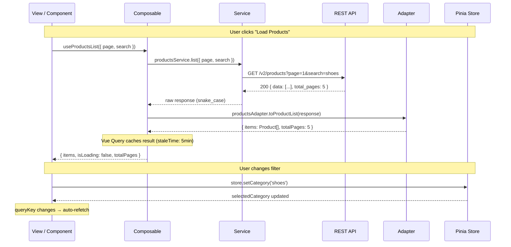
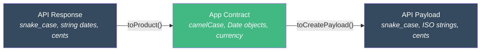
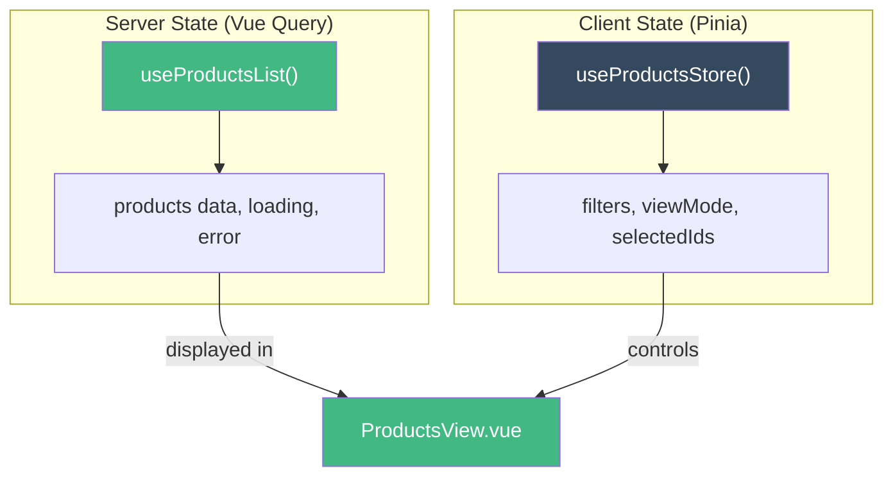

# Responsibility Layers

Each layer in the architecture has a single, well-defined responsibility.

## Complete Request Flow



## Service — Pure HTTP

Services make the HTTP request. Nothing else.

```typescript
// services/products-service.ts
import { api } from '@/shared/services/api-client'
import type {
  ProductListResponse,
  ProductItemResponse,
  CreateProductPayload,
} from '../types/products.types'

export const productsService = {
  list(params: { page: number; pageSize: number; search?: string }) {
    return api.get<ProductListResponse>('/v2/products', { params })
  },

  getById(id: string) {
    return api.get<ProductItemResponse>(`/v2/products/${id}`)
  },

  create(payload: CreateProductPayload) {
    return api.post<ProductItemResponse>('/v2/products', payload)
  },

  update(id: string, payload: Partial<CreateProductPayload>) {
    return api.patch<ProductItemResponse>(`/v2/products/${id}`, payload)
  },

  delete(id: string) {
    return api.delete(`/v2/products/${id}`)
  },
}
```

**Rules:**

- ✅ HTTP calls with typed request/response
- ✅ One file per domain/resource
- ✅ Export as object with methods
- ❌ No try/catch (caller handles errors)
- ❌ No data transformation (adapter does this)
- ❌ No business logic
- ❌ No store/composable access

::: warning Common mistake
Don't add `try/catch` in services. Error handling belongs in the composable layer via Vue Query's `onError`.
:::

## Adapter — Contract Parsers

Adapters transform data between API format and app format. They are **pure functions** with no side effects.



```typescript
// adapters/products-adapter.ts
import type { ProductItemResponse } from '../types/products.types'
import type { Product } from '../types/products.contracts'

export const productsAdapter = {
  // Inbound: API → App
  toProduct(response: ProductItemResponse): Product {
    return {
      id: response.uuid,
      name: response.name,
      description: response.description,
      vendor: response.vendor_name,
      category: response.category_slug,
      price: response.price_cents / 100,
      isActive: response.status === 'active',
      imageUrl: response.image_url,
      createdAt: new Date(response.created_at),
      updatedAt: new Date(response.updated_at),
    }
  },

  // Outbound: App → API
  toCreatePayload(input: CreateProductInput): CreateProductPayload {
    return {
      name: input.name,
      description: input.description,
      vendor_name: input.vendor,
      category_slug: input.category,
      price_cents: Math.round(input.price * 100),
      image_url: input.imageUrl,
    }
  },
}
```

**Rules:**

- ✅ Pure functions (input → output)
- ✅ Bidirectional: API → App (inbound) and App → API (outbound)
- ✅ Rename fields (snake_case → camelCase)
- ✅ Convert types (string → Date, cents → decimal, status → boolean)
- ❌ No HTTP calls
- ❌ No store/composable access

## Types and Contracts

Two separate files for the same resource:

```typescript
// types/products.types.ts — Exact API response (snake_case)
export interface ProductItemResponse {
  uuid: string
  name: string
  description: string
  vendor_name: string
  category_slug: string
  price_cents: number
  status: 'active' | 'inactive' | 'pending'
  image_url: string | null
  created_at: string       // ISO 8601
  updated_at: string       // ISO 8601
}

export interface ProductListResponse {
  data: ProductItemResponse[]
  total_pages: number
  current_page: number
}
```

```typescript
// types/products.contracts.ts — App contract (camelCase)
export interface Product {
  id: string
  name: string
  description: string
  vendor: string
  category: string
  price: number            // in currency, not cents
  isActive: boolean        // derived from status
  imageUrl: string | null
  createdAt: Date          // Date object, not string
  updatedAt: Date
}
```

::: tip Why two files?
- `.types.ts` mirrors the API exactly — if the API changes, only this file changes
- `.contracts.ts` is what your components actually use — stable app interface
- The adapter bridges the gap between them
:::

## Composable — Orchestration

Composables connect everything: call service, pass through adapter, manage loading/error, expose reactive data.

```typescript
// composables/useProductsList.ts
import { computed, type MaybeRef, toValue } from 'vue'
import { useQuery, keepPreviousData } from '@tanstack/vue-query'
import { productsService } from '../services/products-service'
import { productsAdapter } from '../adapters/products-adapter'

export function useProductsList(options: {
  page: MaybeRef<number>
  pageSize?: MaybeRef<number>
  search?: MaybeRef<string>
}) {
  const page = computed(() => toValue(options.page))
  const pageSize = computed(() => toValue(options.pageSize) ?? 20)
  const search = computed(() => toValue(options.search) ?? '')

  const { data, isLoading, isFetching, error, refetch } = useQuery({
    queryKey: computed(() => [
      'products', 'list',
      { page: page.value, pageSize: pageSize.value, search: search.value },
    ]),
    queryFn: async () => {
      const response = await productsService.list({
        page: page.value,
        pageSize: pageSize.value,
        search: search.value,
      })
      return {
        items: response.data.data.map(productsAdapter.toProduct),
        totalPages: response.data.total_pages,
      }
    },
    staleTime: 5 * 60 * 1000,     // 5 minutes
    placeholderData: keepPreviousData,
  })

  const items = computed(() => data.value?.items ?? [])
  const totalPages = computed(() => data.value?.totalPages ?? 0)
  const isEmpty = computed(() => !isLoading.value && items.value.length === 0)

  return { items, totalPages, isLoading, isFetching, isEmpty, error, refetch }
}
```

**Mutation example:**

```typescript
// composables/useCreateProduct.ts
import { useMutation, useQueryClient } from '@tanstack/vue-query'
import { productsService } from '../services/products-service'
import { productsAdapter } from '../adapters/products-adapter'
import type { CreateProductInput } from '../types/products.contracts'

export function useCreateProduct() {
  const queryClient = useQueryClient()

  const { mutate, isPending, error } = useMutation({
    mutationFn: (input: CreateProductInput) => {
      const payload = productsAdapter.toCreatePayload(input)
      return productsService.create(payload)
    },
    onSuccess: () => {
      queryClient.invalidateQueries({ queryKey: ['products'] })
    },
  })

  return { createProduct: mutate, isPending, error }
}
```

**Rules:**

- ✅ Orchestrate: service → adapter → reactive data
- ✅ Manage loading, error, empty states
- ✅ Return refs/computed (never raw values)
- ✅ Named `useXxx`
- ❌ No template/rendering
- ❌ No direct API access

## Pinia Store — Client State Only

Pinia is for state that **does not come from the server**: UI state, filters, preferences.



```typescript
// stores/products-store.ts
import { defineStore } from 'pinia'
import { ref, computed, readonly } from 'vue'

export const useProductsStore = defineStore('products', () => {
  // State
  const selectedCategory = ref<string | null>(null)
  const viewMode = ref<'grid' | 'list'>('grid')
  const searchQuery = ref('')
  const selectedIds = ref<Set<string>>(new Set())

  // Getters
  const hasActiveFilters = computed(() =>
    !!selectedCategory.value || !!searchQuery.value
  )

  const selectedCount = computed(() => selectedIds.value.size)

  // Actions
  function setCategory(category: string | null) {
    selectedCategory.value = category
  }

  function clearFilters() {
    selectedCategory.value = null
    searchQuery.value = ''
  }

  function toggleSelection(id: string) {
    if (selectedIds.value.has(id)) {
      selectedIds.value.delete(id)
    } else {
      selectedIds.value.add(id)
    }
  }

  return {
    // Readonly state
    selectedCategory: readonly(selectedCategory),
    viewMode: readonly(viewMode),
    searchQuery,
    selectedIds: readonly(selectedIds),
    // Getters
    hasActiveFilters,
    selectedCount,
    // Actions
    setCategory,
    clearFilters,
    toggleSelection,
  }
})
```

**Rules:**

- ✅ Client state only (UI, filters, preferences, session)
- ✅ Setup syntax
- ✅ `readonly()` on exposed state
- ✅ `storeToRefs()` when destructuring in components
- ❌ No server state (API data goes in Vue Query)
- ❌ No HTTP calls
