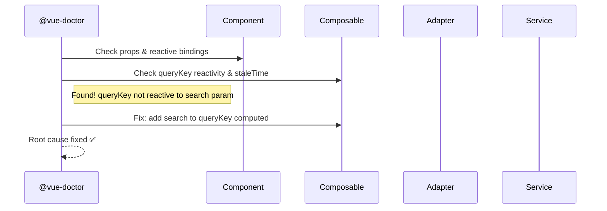

# Quick Start

After [installing](/guide/installation) Vue Dev Kit, open Claude Code in your project. Let's build a real feature step by step.

## Scenario: Building a Products Module

Imagine you're building an e-commerce app and need a Products module with listing, details, and CRUD operations. Here's how Vue Dev Kit helps at every step.


### Step 1 — Scaffold the Module

```bash
"Use @vue-builder to create a products module with CRUD for the /v2/products endpoint"
```

The builder reads your `ARCHITECTURE.md`, asks about endpoint details, then creates the full structure:

```text
src/modules/products/
├── types/
│   ├── products.types.ts       ← API response (snake_case)
│   └── products.contracts.ts   ← App contract (camelCase)
├── adapters/
│   └── products-adapter.ts     ← API ↔ App transformation
├── services/
│   └── products-service.ts     ← Pure HTTP calls
├── composables/
│   ├── useProductsList.ts      ← List with pagination
│   └── useProductDetail.ts     ← Single product query
├── stores/
│   └── products-store.ts       ← Client state (filters, UI)
├── components/
│   ├── ProductsTable.vue       ← Data table
│   ├── ProductForm.vue         ← Create/edit form
│   └── ProductCard.vue         ← Card component
├── views/
│   └── ProductsView.vue        ← Page layout
├── __tests__/
└── index.ts                    ← Barrel export
```

### Step 2 — Review the Generated Code

```bash
"Use @vue-reviewer to review the products module"
```

Output example:

```text
## Review — src/modules/products/

### Auto: tsc ✅ | ESLint ✅ | Build ✅ | Tests ✅

### 🟢 Compliant
  - services/products-service.ts: HTTP only, no try/catch ✅
  - adapters/products-adapter.ts: Pure functions, bidirectional ✅
  - types/: .types.ts and .contracts.ts properly separated ✅
  - composables/: staleTime set, reactive queryKey ✅

### ✨ Highlights
  - ProductsTable.vue: Clean composition with slots

## Verdict: ✅ Approved
```

### Step 3 — Add a Feature

Need to add search and category filtering?

```bash
"Use @vue-builder to create a useProductsFilter composable with search and category filters"
```

### Step 4 — Investigate Issues

Something not working? The doctor traces through layers:

```bash
"Use @vue-doctor to investigate why products aren't loading after search"
```



### Step 5 — Migrate Existing Code

Have an old component using Options API?

```bash
"Use @vue-migrator to convert OldProductsPage.vue to script setup"
```

Before:

```vue
<script>
export default {
  props: { categoryId: String },
  data() {
    return { products: [], loading: false }
  },
  computed: {
    filteredProducts() {
      return this.products.filter(p => p.active)
    }
  },
  methods: {
    async fetchProducts() {
      this.loading = true
      const res = await axios.get('/api/products')
      this.products = res.data
      this.loading = false
    }
  },
  mounted() { this.fetchProducts() }
}
</script>
```

After:

```vue
<script setup lang="ts">
import { computed } from 'vue'
import { useProductsList } from '../composables/useProductsList'

const props = defineProps<{
  categoryId?: string
}>()

const { items, isLoading } = useProductsList({
  category: computed(() => props.categoryId),
})

const filteredProducts = computed(() =>
  items.value.filter(p => p.isActive)
)
</script>
```

---

## More Common Workflows

### Explore an Existing Module

```bash
"Use @vue-reviewer to explore src/modules/auth/"
```

Produces a read-only report: file inventory, patterns used, anti-patterns found, dependency map.

### Create Just a Service Layer

```bash
/dev-create-service orders
```

Creates 4 files: `orders.types.ts` + `orders.contracts.ts` + `orders-adapter.ts` + `orders-service.ts`

### Full Code Review Before PR

```bash
/review-review
```

Runs tsc, ESLint, Vitest, build + manual pattern review. Outputs verdict with violations, attention items, and highlights.

### Check Architecture Conformance

```bash
/review-check-architecture payments
```

### Migrate an Entire Module

```bash
/migration-migrate-module src/legacy/billing/
```

6-phase process with approval gates between each phase.

### Generate Tests

```bash
/dev-create-test src/modules/products/adapters/products-adapter.ts
```

Creates `__tests__/products-adapter.spec.ts` with tests for all adapter transformations.

---

## What's Next

- [Architecture Overview](/guide/architecture) — Understand the patterns your code follows
- [Layers](/guide/layers) — Deep dive into Service, Adapter, Composable layers
- [Agents Reference](/reference/agents) — Detailed guide for each agent
- [Commands Reference](/reference/commands) — All available slash commands
