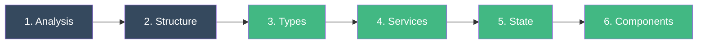

# Agents

Agents are specialized AIs that Claude delegates to automatically or that you invoke with `@name`.

Vue Dev Kit includes **4 consolidated agents** organized into two scenarios:

```mermaid
graph TB
    User["You ask Claude"] --> Detect{"What do you need?"}

    subgraph daily["🏗️ Day-to-Day"]
        Builder["@vue-builder<br/><i>create, scaffold, test</i>"]
        Reviewer["@vue-reviewer<br/><i>review, explore, performance</i>"]
        Doctor["@vue-doctor<br/><i>bug, error, broken</i>"]
    end

    subgraph migration["🔄 Migration"]
        Migrator["@vue-migrator<br/><i>migrate, convert, modernize</i>"]
        ReviewerM["@vue-reviewer<br/><i>diagnose, validate</i>"]
    end

    Detect --> daily
    Detect --> migration

    style User fill:#42b883,color:#fff
    style Detect fill:#35495e,color:#fff
    style daily fill:#f0faf5,stroke:#42b883
    style migration fill:#f0f4fa,stroke:#35495e
    style Builder fill:#42b883,color:#fff
    style Reviewer fill:#42b883,color:#fff
    style Doctor fill:#42b883,color:#fff
    style Migrator fill:#35495e,color:#fff
    style ReviewerM fill:#35495e,color:#fff
```



---

## 🏗️ Day-to-Day Agents

These agents are for **everyday development** — building features, reviewing code, and fixing bugs.

### @vue-builder — Build New Code

**When to use:** Create any new code — modules, components, services, composables, or tests.


### Real-world examples

```bash
# E-commerce: scaffold a full products module
"Use @vue-builder to create a products module with CRUD for GET/POST/PATCH/DELETE /v2/products"

# Dashboard: create a chart component
"Use @vue-builder to create a SalesChart component that receives data via props and uses Chart.js"

# API integration: connect to a new endpoint
"Use @vue-builder to create the service layer for /v3/orders with list, getById, and cancel"

# Testing: generate tests for an adapter
"Use @vue-builder to create tests for src/modules/products/adapters/products-adapter.ts"
```

### Module mode workflow

1. Asks: resource name, endpoints, UI type, client state needs
2. Reads `ARCHITECTURE.md` for conventions
3. Scaffolds `src/modules/[kebab-name]/` with all subdirectories
4. Creates bottom-up: types → contracts → adapter → service → store → composables → components → view
5. Registers lazy route, creates barrel export
6. Validates with `tsc --noEmit`

### Component mode

- Places in `src/modules/[feature]/components/` or `src/shared/components/`
- `<script setup lang="ts">` with typed defineProps/defineEmits
- < 200 lines, no prop drilling, handles loading/error/empty states

### Service mode

Creates 4 files:

- `.types.ts` — API response types (snake_case)
- `.contracts.ts` — App contracts (camelCase)
- `-adapter.ts` — Pure bidirectional parser
- `-service.ts` — HTTP calls only

### Composable mode

- **Query**: useQuery with reactive queryKey, staleTime, adapter
- **Mutation**: useMutation with invalidateQueries, adapter for payload
- **Shared logic**: ref/computed with lifecycle hooks

### Test mode

Priority: adapters (pure, easy) > composables (mock service) > components (@vue/test-utils)

---

### @vue-reviewer — Review & Analyze

**When to use:** Review code changes, explore modules, analyze performance.


### Real-world examples

```bash
# Before merging a PR
"Use @vue-reviewer to review the changes in the payments module"

# Onboarding on a new module
"Use @vue-reviewer to explore src/modules/auth/ — I'm new to this codebase"

# Performance audit
"Use @vue-reviewer to check performance of the dashboard — it feels slow"
```

### Review mode

- Runs automated checks: `tsc`, `eslint`, `vitest`, `build`
- Pattern checks against `ARCHITECTURE.md`
- Classification: 🔴 Violation | 🟡 Attention | 🟢 Compliant | ✨ Highlight
- **Verdict:** ✅ Approved | ⚠️ With caveats | ❌ Requires changes

### Explore mode

- Inventories files by type (components, services, composables, stores)
- Detects Options vs setup, JS vs TS, mixins, anti-patterns
- Maps dependencies (fan-in / fan-out)
- Read-only report with facts and numbers

### Performance mode

- Bundle size analysis via `vite build`
- Lazy loading verification (routes should use `() => import(...)`)
- Queries without staleTime
- Deep watchers, inline template objects
- Bottlenecks sorted by user impact

::: tip Read-only
The reviewer never modifies files. It suggests fixes with code snippets you can apply.
:::

---

## 🔄 Migration Agents

These agents are for **modernizing legacy projects** — converting Options API to setup, JS to TS, Vuex to Pinia + Vue Query. Use `@vue-reviewer` first to diagnose the current state, then `@vue-migrator` to execute the migration.

### @vue-migrator — Modernize Legacy Code

**When to use:** Migrate Options API → script setup, JS → TS, or full module modernization.


### Real-world examples

```bash
# Modernize an entire legacy module
"Use @vue-migrator to migrate src/legacy/billing/ to the new architecture"

# Convert a single component
"Use @vue-migrator to convert UserSettingsForm.vue from Options API to script setup"

# JS to TypeScript migration
"Use @vue-migrator to convert the auth module from JavaScript to TypeScript"
```

### Module mode (6 phases)



1. **Analysis** — Map current state: file counts, Options vs setup, JS vs TS, mixins
2. **Structure** — Create target directories
3. **Types & Adapters** — .types.ts + .contracts.ts + adapter
4. **Services** — Extract HTTP to pure services
5. **State** — Server state → Vue Query, client state → Pinia
6. **Components** — Convert to `<script setup lang="ts">`

Order is bottom-up. User approval required between phases.

### Component mode — Conversion table

| Options API | Script Setup |
|------------|--------------|
| `props` | `defineProps<T>()` |
| `emits` | `defineEmits<T>()` |
| `data()` | `ref()` / `reactive()` |
| `computed` | `computed()` |
| `methods` | Functions |
| `watch` | `watch()` / `watchEffect()` |
| Mixins | Composables |
| `this.$emit` | `emit()` |
| `this.$refs` | `useTemplateRef()` |

Decomposes if > 200 lines. Updates consumers if API changes.

---

### @vue-doctor — Investigate Bugs

**When to use:** Investigate bugs, unexpected behavior, console errors, broken features.

### Real-world examples

```bash
# API error investigation
"Use @vue-doctor to investigate the 500 error on the login page"

# Stale data issue
"Use @vue-doctor to find why the dashboard shows outdated data after saving"

# Component not rendering
"Use @vue-doctor to debug why the ProductCard isn't showing the price"
```

### Trace path (top-down)


At each layer, the doctor checks:

| Layer | Checks |
|-------|--------|
| **Component** | Props correct? Emits firing? Reactive bindings? |
| **Composable** | queryKey reactive? staleTime? Service params? Adapter applied? |
| **Adapter** | Transformation correct? Missing fields? Wrong types? |
| **Service** | URL correct? HTTP method? Params format? |
| **API** | Response shape changed? Fields added/removed? |

::: warning Root cause only
The doctor fixes at the root layer, never patches symptoms. If a bug is in the adapter, it fixes the adapter — not the component.
:::

---

## Full vs Lite Agents

All 4 agents have Lite versions that use `model: haiku` for lower cost.

| Aspect | Full | Lite |
|--------|------|------|
| **Model** | Sonnet/Opus | Haiku |
| **First action** | Reads ARCHITECTURE.md | Rules inline |
| **Validation** | tsc, build, vitest | Skipped |
| **Size** | ~80-120 lines | ~30-50 lines |
| **Cost** | ~5-25k tokens | ~2-10k tokens |

Install lite agents with:

```bash
bash /path/to/vue-dev-kit/setup.sh --lite
```

> **When to use Full vs Lite?**
> - **Full**: new modules, PRs, complex migrations, onboarding
> - **Lite**: quick scaffolding, small components, rapid iterations
