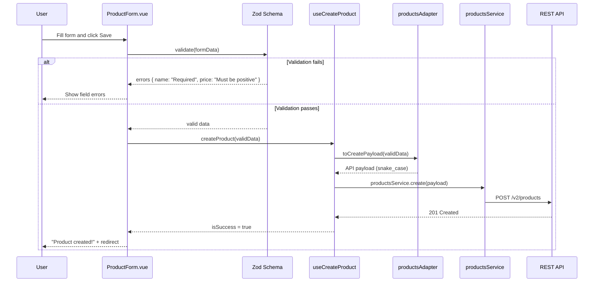
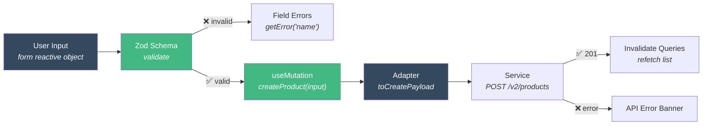

# How to Build Forms with Validation

This tutorial shows how to build a **create/edit form** with Zod validation, useMutation, and proper error handling.

## Scenario

You need a form to create new products. It must:
- Validate inputs before submission
- Show field-level errors
- Handle loading and success states
- Use the adapter to convert data for the API

## Architecture



## Step 1 — Define the Validation Schema

```typescript
// src/modules/products/types/products.schemas.ts

import { z } from 'zod'

export const createProductSchema = z.object({
  name: z
    .string()
    .min(3, 'Name must be at least 3 characters')
    .max(100, 'Name must be at most 100 characters'),
  description: z
    .string()
    .min(10, 'Description must be at least 10 characters')
    .max(500, 'Description too long'),
  category: z
    .string()
    .min(1, 'Please select a category'),
  price: z
    .number({ invalid_type_error: 'Price must be a number' })
    .positive('Price must be positive')
    .max(99999, 'Price too high'),
  imageUrl: z
    .string()
    .url('Must be a valid URL')
    .optional()
    .or(z.literal('')),
})

export type CreateProductFormData = z.infer<typeof createProductSchema>
```

::: tip Zod + Contracts
The Zod schema validates **form input**. The contract in `products.contracts.ts` defines the **app data model**. They can overlap, but serve different purposes.
:::

## Step 2 — Build a Form Validation Composable

```typescript
// src/shared/composables/useFormValidation.ts

import { ref, type Ref } from 'vue'
import type { ZodSchema, ZodError } from 'zod'

export function useFormValidation<T>(schema: ZodSchema<T>) {
  const errors: Ref<Record<string, string>> = ref({})
  const isValid = ref(false)

  function validate(data: unknown): data is T {
    try {
      schema.parse(data)
      errors.value = {}
      isValid.value = true
      return true
    } catch (err) {
      const zodError = err as ZodError
      errors.value = Object.fromEntries(
        zodError.errors.map(e => [e.path.join('.'), e.message])
      )
      isValid.value = false
      return false
    }
  }

  function clearErrors() {
    errors.value = {}
  }

  function getError(field: string): string | undefined {
    return errors.value[field]
  }

  return { errors, isValid, validate, clearErrors, getError }
}
```

## Step 3 — Build the Mutation Composable

```typescript
// src/modules/products/composables/useCreateProduct.ts

import { useMutation, useQueryClient } from '@tanstack/vue-query'
import { productsService } from '../services/products-service'
import { productsAdapter } from '../adapters/products-adapter'
import type { CreateProductInput } from '../types/products.contracts'

export function useCreateProduct() {
  const queryClient = useQueryClient()

  const { mutate, isPending, error, isSuccess, reset } = useMutation({
    mutationFn: (input: CreateProductInput) => {
      const payload = productsAdapter.toCreatePayload(input)
      return productsService.create(payload)
    },
    onSuccess: () => {
      queryClient.invalidateQueries({ queryKey: ['products'] })
    },
  })

  return {
    createProduct: mutate,
    isPending,
    error,
    isSuccess,
    reset,
  }
}
```

## Step 4 — Build the Form Component

```vue
<!-- src/modules/products/components/ProductForm.vue -->
<script setup lang="ts">
import { reactive, watch } from 'vue'
import { useRouter } from 'vue-router'
import { useFormValidation } from '@/shared/composables/useFormValidation'
import { useCreateProduct } from '../composables/useCreateProduct'
import { createProductSchema, type CreateProductFormData } from '../types/products.schemas'

const router = useRouter()
const { createProduct, isPending, isSuccess, error: apiError } = useCreateProduct()
const { validate, getError, clearErrors } = useFormValidation(createProductSchema)

const form = reactive<CreateProductFormData>({
  name: '',
  description: '',
  category: '',
  price: 0,
  imageUrl: '',
})

const categories = [
  { value: 'electronics', label: 'Electronics' },
  { value: 'clothing', label: 'Clothing' },
  { value: 'books', label: 'Books' },
  { value: 'home', label: 'Home & Garden' },
]

function handleSubmit() {
  clearErrors()

  if (!validate(form)) return

  createProduct({
    name: form.name,
    description: form.description,
    category: form.category,
    price: form.price,
    imageUrl: form.imageUrl || undefined,
  })
}

// Redirect on success
watch(isSuccess, (success) => {
  if (success) {
    router.push({ name: 'products' })
  }
})
</script>

<template>
  <form @submit.prevent="handleSubmit" class="product-form">
    <h2>Create Product</h2>

    <!-- API error banner -->
    <div v-if="apiError" class="error-banner">
      Failed to create product. Please try again.
    </div>

    <!-- Name -->
    <div class="field">
      <label for="name">Product Name *</label>
      <input
        id="name"
        v-model="form.name"
        type="text"
        placeholder="e.g. Wireless Headphones"
        :class="{ invalid: getError('name') }"
      />
      <span v-if="getError('name')" class="field-error">
        {{ getError('name') }}
      </span>
    </div>

    <!-- Description -->
    <div class="field">
      <label for="description">Description *</label>
      <textarea
        id="description"
        v-model="form.description"
        rows="4"
        placeholder="Describe the product..."
        :class="{ invalid: getError('description') }"
      />
      <span v-if="getError('description')" class="field-error">
        {{ getError('description') }}
      </span>
    </div>

    <!-- Category -->
    <div class="field">
      <label for="category">Category *</label>
      <select
        id="category"
        v-model="form.category"
        :class="{ invalid: getError('category') }"
      >
        <option value="">Select a category</option>
        <option
          v-for="cat in categories"
          :key="cat.value"
          :value="cat.value"
        >
          {{ cat.label }}
        </option>
      </select>
      <span v-if="getError('category')" class="field-error">
        {{ getError('category') }}
      </span>
    </div>

    <!-- Price -->
    <div class="field">
      <label for="price">Price (USD) *</label>
      <input
        id="price"
        v-model.number="form.price"
        type="number"
        step="0.01"
        min="0"
        :class="{ invalid: getError('price') }"
      />
      <span v-if="getError('price')" class="field-error">
        {{ getError('price') }}
      </span>
    </div>

    <!-- Image URL -->
    <div class="field">
      <label for="imageUrl">Image URL (optional)</label>
      <input
        id="imageUrl"
        v-model="form.imageUrl"
        type="url"
        placeholder="https://..."
        :class="{ invalid: getError('imageUrl') }"
      />
      <span v-if="getError('imageUrl')" class="field-error">
        {{ getError('imageUrl') }}
      </span>
    </div>

    <!-- Submit -->
    <button type="submit" :disabled="isPending">
      {{ isPending ? 'Creating...' : 'Create Product' }}
    </button>
  </form>
</template>
```

## Form Data Flow



## Edit Mode

To reuse the same form for editing, add a prop and pre-fill:

```vue
<script setup lang="ts">
import type { Product } from '../types/products.contracts'

const props = defineProps<{
  product?: Product // undefined = create, defined = edit
}>()

const form = reactive<CreateProductFormData>({
  name: props.product?.name ?? '',
  description: props.product?.description ?? '',
  category: props.product?.category ?? '',
  price: props.product?.price ?? 0,
  imageUrl: props.product?.imageUrl ?? '',
})

// Use different mutation for edit
const { createProduct, isPending } = props.product
  ? useUpdateProduct(props.product.id)
  : useCreateProduct()
</script>
```

## Key Takeaways

- **Zod** validates at the form boundary — before data enters the system
- **Adapter** converts at the API boundary — before data leaves the system
- **useMutation** handles loading, error, and cache invalidation
- **Components** show state (loading, errors, success) — no business logic

## Next Steps

- [Pagination + Filters](/tutorials/pagination-filters) — Build advanced list patterns
- [CRUD Module Tutorial](/tutorials/crud-module) — See the full module with this form integrated
