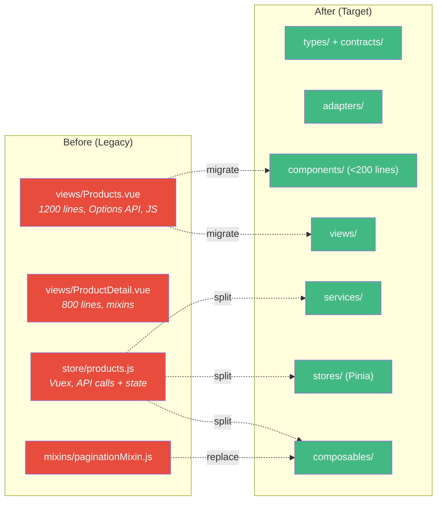
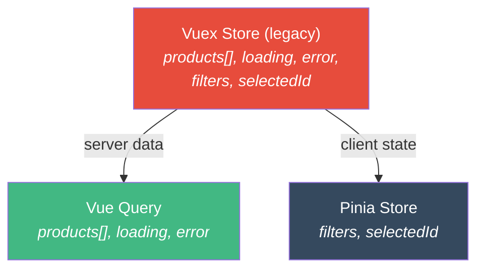
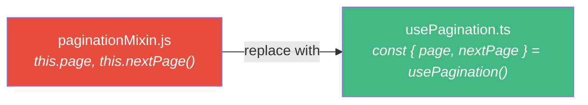

# How to Migrate Your Project Architecture

This guide walks you through migrating a **legacy Vue project** to the Vue Dev Kit architecture. It covers the realistic scenario of a project with everything in `views/`, Options API, JavaScript, no typing, Vuex, and mixins.

## Before vs After



## The 6-Phase Approach


::: warning Bottom-up order
Always migrate from the bottom up: types → adapters → services → composables → components. This way, each layer has its dependency already migrated.
:::

---

## Phase 1 — Diagnosis

Before touching any code, **map what exists**. Use the reviewer agent:

```bash
"Use @vue-reviewer to explore src/views/products/"
```

Or do it manually. Answer these questions:

### Inventory checklist

| Question | How to check | Your answer |
|----------|-------------|-------------|
| How many files? | `find src/ -name "*.vue" -o -name "*.js" -o -name "*.ts" \| wc -l` | |
| Options API vs setup? | Search for `export default {` vs `<script setup` | |
| JavaScript vs TypeScript? | Count `.js` vs `.ts` files | |
| Vuex or Pinia? | Search for `import { mapGetters` or `useStore` | |
| Mixins? | Search for `mixins:` in components | |
| API calls in components? | Search for `axios` or `fetch` in `.vue` files | |
| Components > 200 lines? | Check each `.vue` file length | |
| Cross-module imports? | Search imports between feature folders | |

### Example diagnosis output

```text
Products module:
├── views/Products.vue          (1247 lines, Options API, JS)
├── views/ProductDetail.vue     (823 lines, Options API, JS, uses 2 mixins)
├── store/products.js           (Vuex — API calls + mutations + getters)
├── mixins/paginationMixin.js   (shared pagination logic)
├── mixins/filtersMixin.js      (shared filter logic)
└── api/products.js             (axios calls, some transformation)

Issues found:
- 2 components > 200 lines
- API calls mixed with state management (Vuex actions)
- Data transformation in Vuex getters (should be in adapter)
- Mixins used for shared logic (should be composables)
- No TypeScript, no typed props/emits
- Cross-imports between products/ and orders/
```

---

## Phase 2 — Create Target Structure

Create the module skeleton. Don't move files yet.

```bash
mkdir -p src/modules/products/{types,adapters,services,composables,stores,components,views,__tests__}
touch src/modules/products/index.ts
```

### Validation gate

✅ Directory structure exists and follows the convention.

---

## Phase 3 — Extract Types and Adapters

This is where migration **starts producing value**. You're creating the typed contract for the first time.

### 3.1 — Study the API responses

Open the network tab, hit the endpoints, copy the JSON:

```json
// GET /api/products → what does the response look like?
{
  "id": 42,
  "product_name": "Wireless Mouse",
  "price_in_cents": 2999,
  "is_active": true,
  "created_at": "2025-01-15T10:30:00Z"
}
```

### 3.2 — Create the types file

```typescript
// src/modules/products/types/products.types.ts
export interface ProductResponse {
  id: number
  product_name: string
  price_in_cents: number
  is_active: boolean
  created_at: string
}
```

### 3.3 — Create the contracts file

```typescript
// src/modules/products/types/products.contracts.ts
export interface Product {
  id: number
  name: string
  price: number         // dollars, not cents
  isActive: boolean
  createdAt: Date
}
```

### 3.4 — Create the adapter

```typescript
// src/modules/products/adapters/products-adapter.ts
import type { ProductResponse } from '../types/products.types'
import type { Product } from '../types/products.contracts'

export const productsAdapter = {
  toProduct(response: ProductResponse): Product {
    return {
      id: response.id,
      name: response.product_name,
      price: response.price_in_cents / 100,
      isActive: response.is_active,
      createdAt: new Date(response.created_at),
    }
  },
}
```

### Validation gate

```bash
npx tsc --noEmit  # Types compile without errors
```

---

## Phase 4 — Extract Services

Find all API calls in your legacy code and move them to a pure service.

### Before (in Vuex)

```javascript
// store/products.js (LEGACY)
actions: {
  async fetchProducts({ commit }, { page, search }) {
    try {
      commit('SET_LOADING', true)
      const response = await axios.get('/api/products', { params: { page, search } })
      const products = response.data.map(p => ({
        ...p,
        name: p.product_name,        // transformation here ❌
        price: p.price_in_cents / 100 // transformation here ❌
      }))
      commit('SET_PRODUCTS', products)
    } catch (error) {
      commit('SET_ERROR', error.message)  // error handling here ❌
    } finally {
      commit('SET_LOADING', false)
    }
  }
}
```

### After (pure service)

```typescript
// src/modules/products/services/products-service.ts
import { api } from '@/shared/services/api-client'
import type { ProductResponse } from '../types/products.types'

export const productsService = {
  list(params: { page: number; search?: string }) {
    return api.get<{ data: ProductResponse[] }>('/api/products', { params })
  },
}
```

**What was removed:**
- ❌ `try/catch` → handled by Vue Query in composable
- ❌ `commit('SET_LOADING')` → Vue Query provides `isLoading`
- ❌ `data.map(p => ...)` → adapter handles transformation
- ❌ `commit('SET_PRODUCTS')` → Vue Query caches the data

### Validation gate

✅ Service has only HTTP calls, no try/catch, no transformation.

---

## Phase 5 — Migrate State

### Split Vuex into Pinia + Vue Query



### Before (Vuex)

```javascript
// store/products.js (LEGACY)
export default {
  state: {
    products: [],           // → Vue Query
    loading: false,         // → Vue Query (isLoading)
    error: null,            // → Vue Query (error)
    selectedCategory: null, // → Pinia
    searchQuery: '',        // → Pinia
    currentPage: 1,         // → Pinia
  },
  // ...
}
```

### After — Composable (server state)

```typescript
// src/modules/products/composables/useProductsList.ts
import { computed, type MaybeRef, toValue } from 'vue'
import { useQuery, keepPreviousData } from '@tanstack/vue-query'
import { productsService } from '../services/products-service'
import { productsAdapter } from '../adapters/products-adapter'

export function useProductsList(options: {
  page: MaybeRef<number>
  search?: MaybeRef<string>
}) {
  const { data, isLoading, error } = useQuery({
    queryKey: computed(() => ['products', 'list', {
      page: toValue(options.page),
      search: toValue(options.search),
    }]),
    queryFn: async () => {
      const response = await productsService.list({
        page: toValue(options.page),
        search: toValue(options.search),
      })
      return response.data.data.map(productsAdapter.toProduct)
    },
    staleTime: 5 * 60 * 1000,
    placeholderData: keepPreviousData,
  })

  return {
    items: computed(() => data.value ?? []),
    isLoading,
    error,
  }
}
```

### After — Store (client state)

```typescript
// src/modules/products/stores/products-store.ts
import { defineStore } from 'pinia'
import { ref, readonly } from 'vue'

export const useProductsStore = defineStore('products', () => {
  const searchQuery = ref('')
  const selectedCategory = ref<string | undefined>(undefined)
  const currentPage = ref(1)

  function setSearch(query: string) {
    searchQuery.value = query
    currentPage.value = 1
  }

  return {
    searchQuery: readonly(searchQuery),
    selectedCategory: readonly(selectedCategory),
    currentPage: readonly(currentPage),
    setSearch,
  }
})
```

### Replace Mixins with Composables



```typescript
// src/shared/composables/usePagination.ts
import { ref, computed } from 'vue'

export function usePagination(initialPage = 1) {
  const currentPage = ref(initialPage)

  function nextPage() { currentPage.value++ }
  function prevPage() { if (currentPage.value > 1) currentPage.value-- }
  function goToPage(page: number) { currentPage.value = page }

  return { currentPage, nextPage, prevPage, goToPage }
}
```

### Validation gate

✅ Vuex removed from module, Pinia + Vue Query working, mixins replaced.

---

## Phase 6 — Convert Components

### Before (Options API, 1200+ lines)

```vue
<script>
import { mapGetters, mapActions } from 'vuex'
import paginationMixin from '@/mixins/paginationMixin'
import filtersMixin from '@/mixins/filtersMixin'

export default {
  mixins: [paginationMixin, filtersMixin],
  computed: {
    ...mapGetters('products', ['allProducts', 'isLoading']),
    filteredProducts() {
      return this.allProducts.filter(p =>
        p.name.includes(this.searchQuery)
      )
    },
  },
  methods: {
    ...mapActions('products', ['fetchProducts', 'deleteProduct']),
  },
  mounted() {
    this.fetchProducts()
  },
}
</script>
```

### After (script setup, < 200 lines)

```vue
<script setup lang="ts">
import { storeToRefs } from 'pinia'
import { useProductsStore } from '../stores/products-store'
import { useProductsList } from '../composables/useProductsList'
import ProductsTable from '../components/ProductsTable.vue'
import ProductSearch from '../components/ProductSearch.vue'
import AppPagination from '@/shared/components/AppPagination.vue'

const store = useProductsStore()
const { searchQuery, currentPage } = storeToRefs(store)

const { items, isLoading } = useProductsList({
  page: currentPage,
  search: searchQuery,
})
</script>

<template>
  <div class="products-view">
    <h1>Products</h1>
    <ProductSearch v-model="searchQuery" @update:model-value="store.setSearch" />
    <ProductsTable :products="items" :loading="isLoading" />
    <AppPagination :current-page="currentPage" :total-pages="10" @change="store.setPage" />
  </div>
</template>
```

**What changed:**
- 1200 lines → ~30 lines (view) + small components
- Options API → `<script setup lang="ts">`
- Vuex mapGetters → `storeToRefs(pinia)`
- Vuex mapActions → composable functions
- Mixins → composables
- No types → full TypeScript

### Validation gate

```bash
npx tsc --noEmit && npm run build && npm run test
```

---

## Migration Checklist

Use this checklist for each module:

| Phase | Check | Done |
|-------|-------|------|
| **1. Diagnosis** | Inventoried all files | ☐ |
| | Identified API endpoints | ☐ |
| | Counted Options vs setup, JS vs TS | ☐ |
| **2. Structure** | Module directory created | ☐ |
| **3. Types** | `.types.ts` mirrors API exactly | ☐ |
| | `.contracts.ts` uses camelCase | ☐ |
| | Adapter converts bidirectionally | ☐ |
| | `tsc --noEmit` passes | ☐ |
| **4. Services** | HTTP only, no try/catch | ☐ |
| | No transformation in service | ☐ |
| **5. State** | Server data in Vue Query | ☐ |
| | Client state in Pinia (setup syntax) | ☐ |
| | Mixins replaced with composables | ☐ |
| | Vuex removed from module | ☐ |
| **6. Components** | All `<script setup lang="ts">` | ☐ |
| | All components < 200 lines | ☐ |
| | Typed defineProps/defineEmits | ☐ |
| | No cross-module imports | ☐ |
| | Build + tests pass | ☐ |

## Using the Agent

```bash
# Full module migration (6 phases with approval gates)
"Use @vue-migrator to migrate src/legacy/products/"

# Single component conversion
"Use @vue-migrator to convert ProductsList.vue to script setup"
```

Or use the slash commands:

```bash
/migration-migrate-module src/legacy/products/
/migration-migrate-component src/views/ProductDetail.vue
```

## Tips for Large Projects

- **Migrate one module at a time** — don't try to migrate everything at once
- **Start with the simplest module** — build confidence before tackling complex ones
- **Keep legacy working** — each phase should leave the app functional
- **Use feature flags** if needed — old and new can coexist during migration
- **Test after every phase** — don't wait until the end to validate

## Next Steps

- [CRUD Module Tutorial](/tutorials/crud-module) — See the target architecture in action
- [Service Layer Tutorial](/tutorials/service-layer) — Deep dive into the data layer
- [Architecture Overview](/guide/architecture) — Full architecture reference
