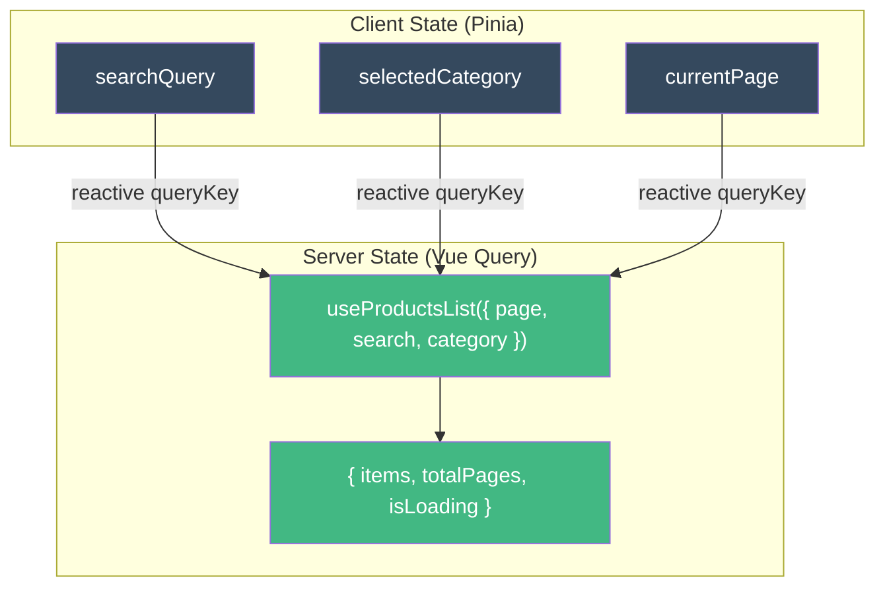
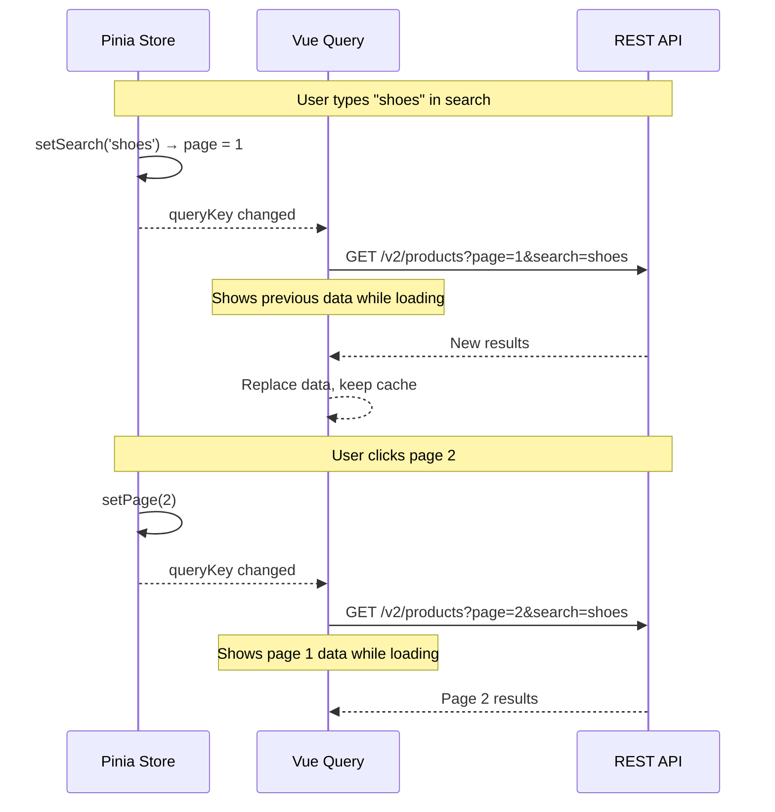
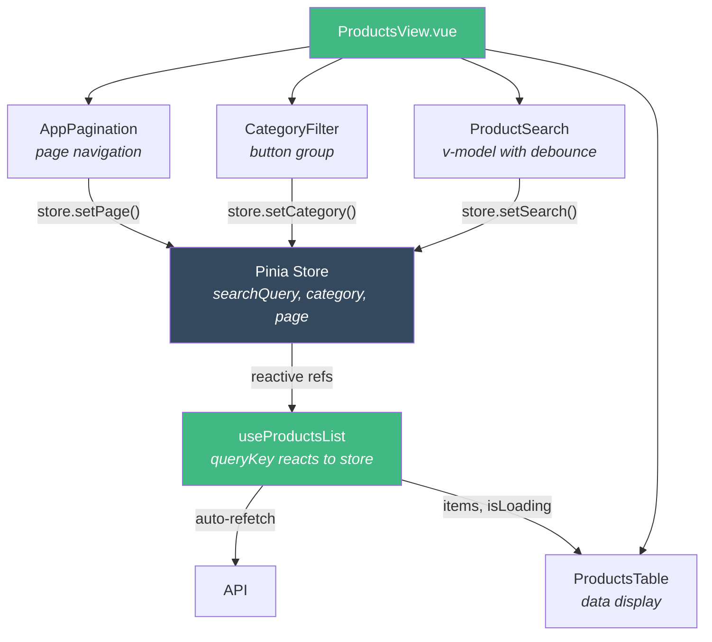

# How to Build Pagination with Filters

This tutorial shows how to build a **paginated list with search and filters**, combining Vue Query reactive queries with Pinia client state.

## Scenario

You need a products listing page with:
- Search by product name
- Filter by category
- Pagination (20 items per page)
- Smooth UX when navigating pages



## Step 1 — Store for Filters (Client State)

Filters are **client state** — they don't come from the server. Pinia manages them.

```typescript
// src/modules/products/stores/products-store.ts

import { defineStore } from 'pinia'
import { ref, computed, readonly } from 'vue'

export const useProductsStore = defineStore('products', () => {
  const searchQuery = ref('')
  const selectedCategory = ref<string | undefined>(undefined)
  const currentPage = ref(1)

  const hasActiveFilters = computed(() =>
    !!searchQuery.value || !!selectedCategory.value
  )

  function setSearch(query: string) {
    searchQuery.value = query
    currentPage.value = 1   // reset page when search changes
  }

  function setCategory(category: string | undefined) {
    selectedCategory.value = category
    currentPage.value = 1   // reset page when filter changes
  }

  function setPage(page: number) {
    currentPage.value = page
  }

  function clearFilters() {
    searchQuery.value = ''
    selectedCategory.value = undefined
    currentPage.value = 1
  }

  return {
    searchQuery: readonly(searchQuery),
    selectedCategory: readonly(selectedCategory),
    currentPage: readonly(currentPage),
    hasActiveFilters,
    setSearch,
    setCategory,
    setPage,
    clearFilters,
  }
})
```

::: tip Why Pinia and not just refs?
Pinia persists filter state when navigating away and back. With local refs, the user loses their filters on every route change.
:::

## Step 2 — Composable with Reactive Query

The composable creates a **reactive queryKey** — when any filter changes, Vue Query automatically refetches.

```typescript
// src/modules/products/composables/useProductsList.ts

import { computed, type MaybeRef, toValue } from 'vue'
import { useQuery, keepPreviousData } from '@tanstack/vue-query'
import { productsService } from '../services/products-service'
import { productsAdapter } from '../adapters/products-adapter'

export function useProductsList(options: {
  page: MaybeRef<number>
  pageSize?: MaybeRef<number>
  search?: MaybeRef<string>
  category?: MaybeRef<string | undefined>
}) {
  const page = computed(() => toValue(options.page))
  const pageSize = computed(() => toValue(options.pageSize) ?? 20)
  const search = computed(() => toValue(options.search) ?? '')
  const category = computed(() => toValue(options.category))

  const { data, isLoading, isFetching, error } = useQuery({
    queryKey: computed(() => ['products', 'list', {
      page: page.value,
      pageSize: pageSize.value,
      search: search.value,
      category: category.value,
    }]),
    queryFn: async () => {
      const response = await productsService.list({
        page: page.value,
        pageSize: pageSize.value,
        search: search.value,
        category: category.value,
      })
      return productsAdapter.toProductList(response.data)
    },
    staleTime: 5 * 60 * 1000,
    placeholderData: keepPreviousData,
  })

  return {
    items: computed(() => data.value?.items ?? []),
    totalPages: computed(() => data.value?.totalPages ?? 0),
    totalCount: computed(() => data.value?.totalCount ?? 0),
    isEmpty: computed(() => !isLoading.value && (data.value?.items.length ?? 0) === 0),
    isLoading,
    isFetching,
    error,
  }
}
```

### Key patterns explained

**`keepPreviousData`** — While fetching page 2, the user still sees page 1 data. Without this, the list flashes empty on every page change.

**`staleTime: 5 * 60 * 1000`** — If the user goes to page 2 and comes back to page 1 within 5 minutes, it won't refetch (uses cache).

**Reactive `queryKey`** — When `page`, `search`, or `category` change, Vue Query sees a new key and fetches automatically. You don't need to call `refetch()`.



## Step 3 — Search Input with Debounce

Don't hit the API on every keystroke. Use a debounced search.

```vue
<!-- src/modules/products/components/ProductSearch.vue -->
<script setup lang="ts">
import { ref, watch } from 'vue'

const props = defineProps<{
  modelValue: string
}>()

const emit = defineEmits<{
  'update:modelValue': [value: string]
}>()

const localSearch = ref(props.modelValue)
let debounceTimer: ReturnType<typeof setTimeout>

watch(localSearch, (value) => {
  clearTimeout(debounceTimer)
  debounceTimer = setTimeout(() => {
    emit('update:modelValue', value)
  }, 300)
})
</script>

<template>
  <input
    v-model="localSearch"
    type="search"
    placeholder="Search products..."
  />
</template>
```

## Step 4 — Category Filter

```vue
<!-- src/modules/products/components/CategoryFilter.vue -->
<script setup lang="ts">

defineProps<{
  selected?: string
  categories: Array<{ value: string; label: string }>
}>()

const emit = defineEmits<{
  change: [category: string | undefined]
}>()
</script>

<template>
  <div class="category-filter">
    <button
      :class="{ active: !selected }"
      @click="emit('change', undefined)"
    >
      All
    </button>
    <button
      v-for="cat in categories"
      :key="cat.value"
      :class="{ active: selected === cat.value }"
      @click="emit('change', cat.value)"
    >
      {{ cat.label }}
    </button>
  </div>
</template>
```

## Step 5 — Pagination Component

```vue
<!-- src/shared/components/AppPagination.vue -->
<script setup lang="ts">
import { computed } from 'vue'

const props = defineProps<{
  currentPage: number
  totalPages: number
}>()

const emit = defineEmits<{
  change: [page: number]
}>()

const pages = computed(() => {
  const range: number[] = []
  const start = Math.max(1, props.currentPage - 2)
  const end = Math.min(props.totalPages, props.currentPage + 2)
  for (let i = start; i <= end; i++) range.push(i)
  return range
})
</script>

<template>
  <nav v-if="totalPages > 1" class="pagination">
    <button
      :disabled="currentPage <= 1"
      @click="emit('change', currentPage - 1)"
    >
      Previous
    </button>

    <button
      v-for="p in pages"
      :key="p"
      :class="{ active: p === currentPage }"
      @click="emit('change', p)"
    >
      {{ p }}
    </button>

    <button
      :disabled="currentPage >= totalPages"
      @click="emit('change', currentPage + 1)"
    >
      Next
    </button>
  </nav>
</template>
```

## Step 6 — The View (Composing Everything)

```vue
<!-- src/modules/products/views/ProductsView.vue -->
<script setup lang="ts">
import { storeToRefs } from 'pinia'
import { useProductsStore } from '../stores/products-store'
import { useProductsList } from '../composables/useProductsList'
import ProductSearch from '../components/ProductSearch.vue'
import CategoryFilter from '../components/CategoryFilter.vue'
import ProductsTable from '../components/ProductsTable.vue'
import AppPagination from '@/shared/components/AppPagination.vue'

const store = useProductsStore()
const { searchQuery, selectedCategory, currentPage, hasActiveFilters } = storeToRefs(store)

const { items, totalPages, totalCount, isLoading, isFetching, isEmpty } = useProductsList({
  page: currentPage,
  search: searchQuery,
  category: selectedCategory,
})

const categories = [
  { value: 'electronics', label: 'Electronics' },
  { value: 'clothing', label: 'Clothing' },
  { value: 'books', label: 'Books' },
]
</script>

<template>
  <div class="products-view">
    <header>
      <h1>Products ({{ totalCount }})</h1>
      <button v-if="hasActiveFilters" @click="store.clearFilters()">
        Clear filters
      </button>
    </header>

    <div class="filters">
      <ProductSearch v-model="searchQuery" @update:model-value="store.setSearch" />
      <CategoryFilter
        :selected="selectedCategory"
        :categories="categories"
        @change="store.setCategory"
      />
    </div>

    <!-- Loading indicator for background refetch -->
    <div v-if="isFetching && !isLoading" class="refetching">
      Updating...
    </div>

    <ProductsTable :products="items" :loading="isLoading" />

    <div v-if="isEmpty && hasActiveFilters" class="no-results">
      No products match your filters.
      <button @click="store.clearFilters()">Clear filters</button>
    </div>

    <AppPagination
      :current-page="currentPage"
      :total-pages="totalPages"
      @change="store.setPage"
    />
  </div>
</template>
```

## How the Pieces Connect



## Key Takeaways

- **Pinia Store** holds filter state (search, category, page) — persists across navigation
- **Vue Query** reacts to queryKey changes — no manual refetch needed
- **`keepPreviousData`** keeps the previous page visible while loading the next
- **Reset page to 1** when filters change — avoid showing an empty page 5
- **Debounce search** — don't hit the API on every keystroke

## Next Steps

- [CRUD Module Tutorial](/tutorials/crud-module) — Full module with forms and mutations
- [Migration Guide](/tutorials/migrate-project) — Migrate your project to this architecture
