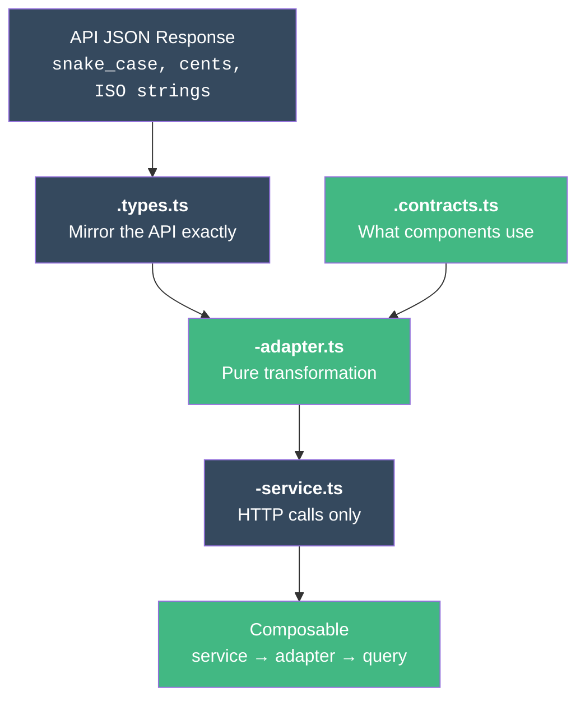

# How to Create a Service Layer

This tutorial shows how to integrate a new API endpoint, step by step. You'll build the complete data layer: **types → contracts → adapter → service**.

## Scenario

Your backend team just shipped a new endpoint: `GET /v3/customers`. You need to integrate it into the app.

Here's the API response:

```json
{
  "data": [
    {
      "uuid": "cust_abc123",
      "full_name": "Jane Cooper",
      "email_address": "jane@example.com",
      "phone_number": "+1-555-0100",
      "company_name": "Acme Corp",
      "is_verified": true,
      "total_orders": 47,
      "lifetime_value_cents": 234500,
      "last_order_at": "2025-11-15T10:30:00Z",
      "created_at": "2024-03-01T08:00:00Z"
    }
  ],
  "pagination": {
    "page": 1,
    "per_page": 25,
    "total": 142
  }
}
```

## Step 1 — Type the API Response

Create the types file mirroring the JSON **exactly** — same field names, same structure.

```typescript
// src/modules/customers/types/customers.types.ts

export interface CustomerResponse {
  uuid: string
  full_name: string
  email_address: string
  phone_number: string | null
  company_name: string | null
  is_verified: boolean
  total_orders: number
  lifetime_value_cents: number
  last_order_at: string | null     // ISO 8601 or null
  created_at: string               // ISO 8601
}

export interface CustomerListResponse {
  data: CustomerResponse[]
  pagination: {
    page: number
    per_page: number
    total: number
  }
}
```

::: tip Pro tip
Copy the JSON response, then type it. Don't rename fields here — that's the adapter's job.
:::

## Step 2 — Define the App Contract

This is what your Vue components will use. Clean names, proper types.

```typescript
// src/modules/customers/types/customers.contracts.ts

export interface Customer {
  id: string
  name: string
  email: string
  phone: string | null
  company: string | null
  isVerified: boolean
  totalOrders: number
  lifetimeValue: number      // in dollars, not cents
  lastOrderAt: Date | null
  createdAt: Date
}

export interface CustomerListResult {
  items: Customer[]
  page: number
  total: number
}
```

Notice the differences:

| API (`types.ts`) | App (`contracts.ts`) | Why |
|---|---|---|
| `uuid` | `id` | Simpler name |
| `full_name` | `name` | No redundant prefix |
| `email_address` | `email` | Shorter |
| `lifetime_value_cents` | `lifetimeValue` | Converted to dollars |
| `string` dates | `Date` objects | Proper type |

## Step 3 — Build the Adapter

The adapter bridges the gap between the two formats. **Pure functions only.**

```typescript
// src/modules/customers/adapters/customers-adapter.ts

import type { CustomerResponse, CustomerListResponse } from '../types/customers.types'
import type { Customer, CustomerListResult } from '../types/customers.contracts'

export const customersAdapter = {
  toCustomer(response: CustomerResponse): Customer {
    return {
      id: response.uuid,
      name: response.full_name,
      email: response.email_address,
      phone: response.phone_number,
      company: response.company_name,
      isVerified: response.is_verified,
      totalOrders: response.total_orders,
      lifetimeValue: response.lifetime_value_cents / 100,
      lastOrderAt: response.last_order_at
        ? new Date(response.last_order_at)
        : null,
      createdAt: new Date(response.created_at),
    }
  },

  toCustomerList(response: CustomerListResponse): CustomerListResult {
    return {
      items: response.data.map(customersAdapter.toCustomer),
      page: response.pagination.page,
      total: response.pagination.total,
    }
  },
}
```

::: warning Handle nullables
Always check for `null` before converting. `response.last_order_at` can be `null` — the adapter must handle that, not the component.
:::

## Step 4 — Build the Service

The service is the simplest layer. HTTP calls with typed request/response. Nothing else.

```typescript
// src/modules/customers/services/customers-service.ts

import { api } from '@/shared/services/api-client'
import type { CustomerResponse, CustomerListResponse } from '../types/customers.types'

export const customersService = {
  list(params: { page?: number; perPage?: number; search?: string }) {
    return api.get<CustomerListResponse>('/v3/customers', { params })
  },

  getById(id: string) {
    return api.get<{ data: CustomerResponse }>(`/v3/customers/${id}`)
  },
}
```

**Rules checklist:**
- ✅ HTTP calls only
- ✅ Typed generics on `api.get<T>`
- ✅ No try/catch
- ✅ No data transformation
- ✅ No adapter calls

## Step 5 — Use in a Composable

Now connect everything:

```typescript
// src/modules/customers/composables/useCustomersList.ts

import { computed, type MaybeRef, toValue } from 'vue'
import { useQuery } from '@tanstack/vue-query'
import { customersService } from '../services/customers-service'
import { customersAdapter } from '../adapters/customers-adapter'

export function useCustomersList(options: {
  page: MaybeRef<number>
  search?: MaybeRef<string>
}) {
  const page = computed(() => toValue(options.page))
  const search = computed(() => toValue(options.search) ?? '')

  const { data, isLoading, error } = useQuery({
    queryKey: computed(() => ['customers', 'list', {
      page: page.value,
      search: search.value,
    }]),
    queryFn: async () => {
      const response = await customersService.list({
        page: page.value,
        search: search.value,
      })
      return customersAdapter.toCustomerList(response.data)
    },
    staleTime: 5 * 60 * 1000,
  })

  return {
    items: computed(() => data.value?.items ?? []),
    total: computed(() => data.value?.total ?? 0),
    isLoading,
    error,
  }
}
```

## The 4-File Pattern



## Testing the Adapter

Adapters are the **easiest layer to test** — pure input/output.

```typescript
// src/modules/customers/__tests__/customers-adapter.spec.ts

import { describe, it, expect } from 'vitest'
import { customersAdapter } from '../adapters/customers-adapter'

describe('customersAdapter', () => {
  const apiResponse = {
    uuid: 'cust_abc123',
    full_name: 'Jane Cooper',
    email_address: 'jane@example.com',
    phone_number: '+1-555-0100',
    company_name: 'Acme Corp',
    is_verified: true,
    total_orders: 47,
    lifetime_value_cents: 234500,
    last_order_at: '2025-11-15T10:30:00Z',
    created_at: '2024-03-01T08:00:00Z',
  }

  it('converts snake_case to camelCase', () => {
    const result = customersAdapter.toCustomer(apiResponse)
    expect(result.name).toBe('Jane Cooper')
    expect(result.email).toBe('jane@example.com')
    expect(result.isVerified).toBe(true)
  })

  it('converts cents to dollars', () => {
    const result = customersAdapter.toCustomer(apiResponse)
    expect(result.lifetimeValue).toBe(2345)
  })

  it('converts ISO strings to Date objects', () => {
    const result = customersAdapter.toCustomer(apiResponse)
    expect(result.createdAt).toBeInstanceOf(Date)
    expect(result.lastOrderAt).toBeInstanceOf(Date)
  })

  it('handles null dates', () => {
    const result = customersAdapter.toCustomer({
      ...apiResponse,
      last_order_at: null,
    })
    expect(result.lastOrderAt).toBeNull()
  })
})
```

## Using the Agent Instead

```bash
"Use @vue-builder to create the service layer for /v3/customers"
```

Or use the slash command:

```bash
/dev-create-service customers
```

## Next Steps

- [CRUD Module Tutorial](/tutorials/crud-module) — Build a complete module from scratch
- [Forms Tutorial](/tutorials/forms) — Create a customer form with Zod validation
